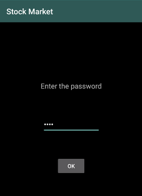
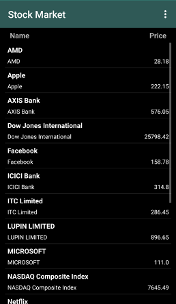
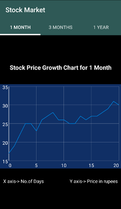
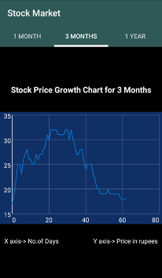
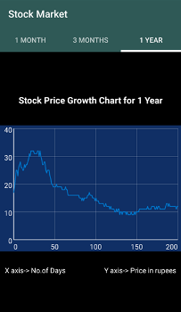

# **Android Stock Market App**
This application is mainly aimed at people who invest in the stock market and would like to keep track of the price dips and highs. 

Dated: Aug-Dec 2018

## **Functionality**
* The application has multiple views that are convenient for the user to study.
* There are graphs which show the growth of a particular company for three different time periods.
* Multiple pure android components like options menu, context menu, tab layout, fragments, graph view, and list view were used in this project. 
* This project also utilizes SQLite database connectivity to store all the data required

Attached are screenshots from the application:

</img>

*The app comes with an in built app lock*

</img>

*A scrollview of the companies available along with the price in INR*

        

*Growth charts of AMD for specific periods of time*

